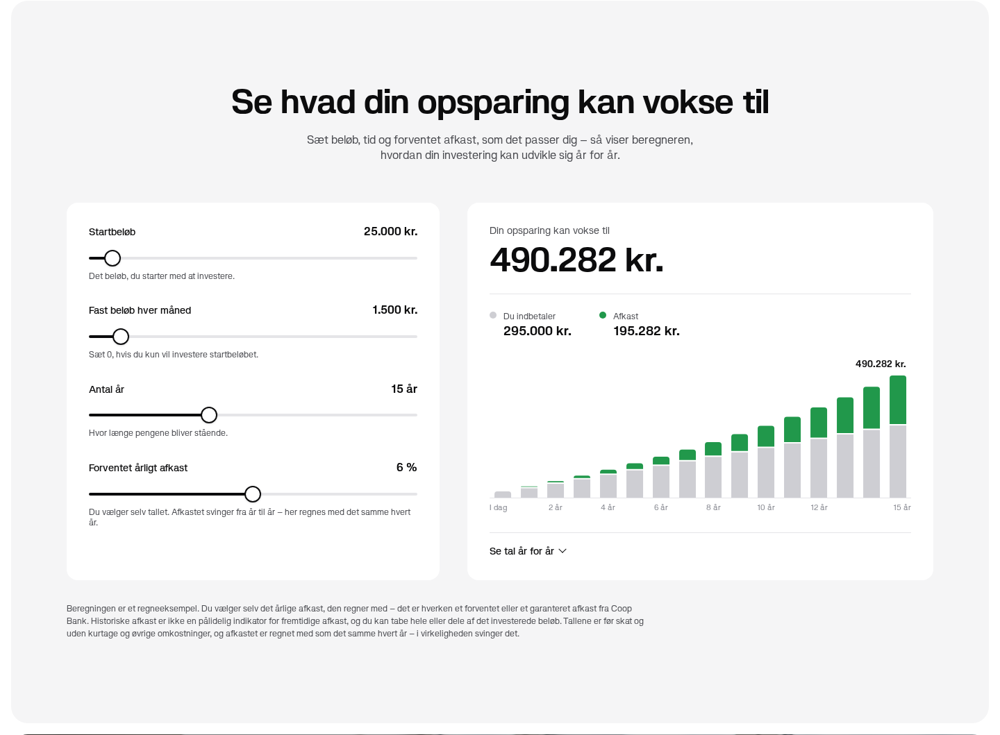
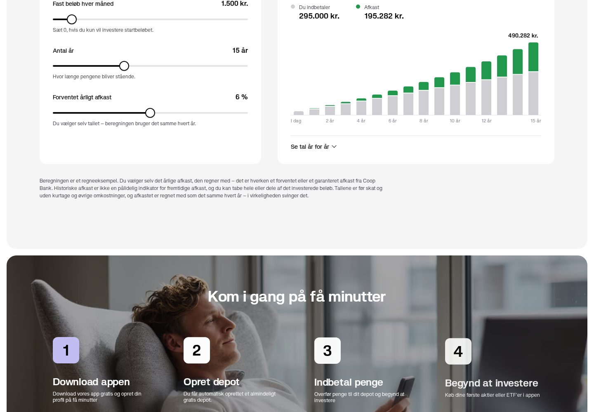

# Afkastberegner til coopbank.dk/investering

En interaktiv beregner, der viser hvad en opsparing kan vokse til med et startbeløb,
et fast månedligt beløb, en tidshorisont og et afkast, brugeren selv vælger.



## Hvor den skal ind

Direkte **over sektionen „Kom i gang på få minutter"** — altså mellem „Fordele når du
investerer med Coop Bank" og trin-banneret. Rækkefølgen på siden bliver:

```
… Fordele når du investerer med Coop Bank      (grå panel)
→  Se hvad din opsparing kan vokse til         (ny sektion — denne)
   Kom i gang på få minutter                   (mørkt banner)
   Vælg hvordan du investerer …
```



## Sådan lægges den på i Webflow

1. Åbn `/investering` i Designeren.
2. Indsæt et **Embed**-element lige før sektionen med „Kom i gang på få minutter".
   Embed'et bringer sin egen sektion, container og afstand med, så det skal ikke
   ligge inde i en eksisterende sektion.
3. Kopiér alt i `afkastberegner.html` mellem
   `KLIP HER – START PÅ EMBED` og `KLIP HER – SLUT PÅ EMBED` ind i Embed'et.
   Det er én blok med `<style>`, markup og `<script>`.
4. Publicér.

Alt uden for de to markører — `@font-face` for Porteron og en hvid sidebaggrund —
er kun til at se filen i en browser for sig selv. Sitet har allerede begge dele.

Embed'et henter intet udefra: ingen biblioteker, ingen API-kald, ingen cookies.
Grafen er SVG tegnet i filen selv.

## Sådan regner den

Den månedlige rente er afledt af den årlige, så „6 % om året" også betyder 6 % om
året når der indbetales månedligt:

```
i     = (1 + r)^(1/12) − 1              r = årligt afkast, i = månedlig rente
værdi = start·(1+i)^n + md·((1+i)^n − 1)/i        n = antal måneder
indbetalt = start + md·n
afkast    = værdi − indbetalt
```

Månedens indbetaling regnes ved månedens udgang, og `i = 0` håndteres for sig
(så 0 % ikke dividerer med nul). Grafen og tabellen viser samme tal, år for år.

**Ikke med i beregningen:** kurtage, skat, depotomkostninger og inflation. Afkastet
regnes som det samme hvert år. Det står i forbeholdet under beregneren, og
formuleringen bør gennemses af jer, før den går på produktionssitet.

Tallene i beregneren er brugerens egne valg — der er ingen påstand om, hvad Coop Bank
eller et bestemt investeringsbevis giver i afkast. Det er bevidst: så snart et
standardtal knyttes til et produktnavn, er det et afkastudsagn, der skal godkendes.

## Felter

| Felt | Skyder | Kan tastes op til |
|---|---|---|
| Startbeløb | 0 – 500.000 kr. | 10.000.000 kr. |
| Fast beløb hver måned | 0 – 20.000 kr. | 250.000 kr. |
| Antal år | 1 – 40 år | 50 år |
| Forventet årligt afkast | 0 – 12 % | 20 % |

Hvert felt kan både trækkes og tastes. Tal tastes i dansk format (`25.000`, `7,5`),
og feltet viser den rå værdi, mens man skriver.

## Design

Værdierne er aflæst på coopbank.dk 11. september 2026 med browserens beregnede
stilarter, ikke gættet:

| | |
|---|---|
| Skrift | Porteron, Arial, sans-serif |
| Panel | `#f5f5f6`, radius 24 px, padding 120/80 px (80/16 px på mobil) |
| Kort | hvid, radius 16 px, padding 32 px (24 px på mobil) |
| Overskrift | 48 px / 36 px på mobil, vægt 600, `letter-spacing −0.02em` |
| Brødtekst | `#4c4d52` |
| Container | max 1920 px, 16 px sidepadding — samme bredde som nabosektionerne |

Grafens to farver er brandfarver: afkast i `green-600 #21984b`, indbetalt i
`neutral-200 #ceced3`. Parret er kontrolleret for farveblindhed (ΔE 24 protan,
30 for normalt syn — begge godt over grænsen), og identitet står aldrig kun på
farven: hver størrelse har sin egen tekstværdi i opdelingen over grafen.

Alt CSS er scopet under `.cbx-`, så blokken ikke kan ramme resten af sitet, og
alt er sat eksplicit frem for at arve fra Webflow-klasser — så ser den ens ud
uanset hvad der ændres i designsystemet.

## Tilgængelighed

- Felterne har rigtige `<label>`, skyderne er almindelige `<input type="range">`
  og virker med tastatur.
- Resultatet er et `aria-live`-område, så det læses op, når man ændrer et tal.
- Grafen har en tekstbeskrivelse, og alle tal findes i tabellen „Se tal år for år" —
  intet er låst inde i en tooltip.
- Fokusmarkering bruger sitets egen `blue-600`.
- `prefers-reduced-motion` slår overgange fra.

## Testet

Chromium via Playwright, både alene og indsat i en lokal kopi af den rigtige
`/investering`-side (1440 px og 390 px):

- Tallene er kontrolleret mod en uafhængig beregning i Python: 25.000 + 1.500/md
  i 15 år ved 6 % → 295.000 indbetalt, 195.282 i afkast, 490.282 i alt. Også
  kontrolleret ved 0 %, uden månedlig indbetaling, ved 1 år og ved 0 i alle felter.
- Panelet får præcis samme bredde som nabosektionen (1408 px desktop, 390 px mobil),
  og overskriften samme størrelse som sidens øvrige (48/36 px).
- Ingen vandret scroll ved 390 px. Ingen fejl i konsollen.
- Tastede værdier over maksimum klippes. Meget lange beløb skrumper overskriften
  frem for at sprænge kortet.
- Årstal på x-aksen sættes på runde spring og klippes ikke i kanterne.
- Tooltip virker på både hover og tryk.
